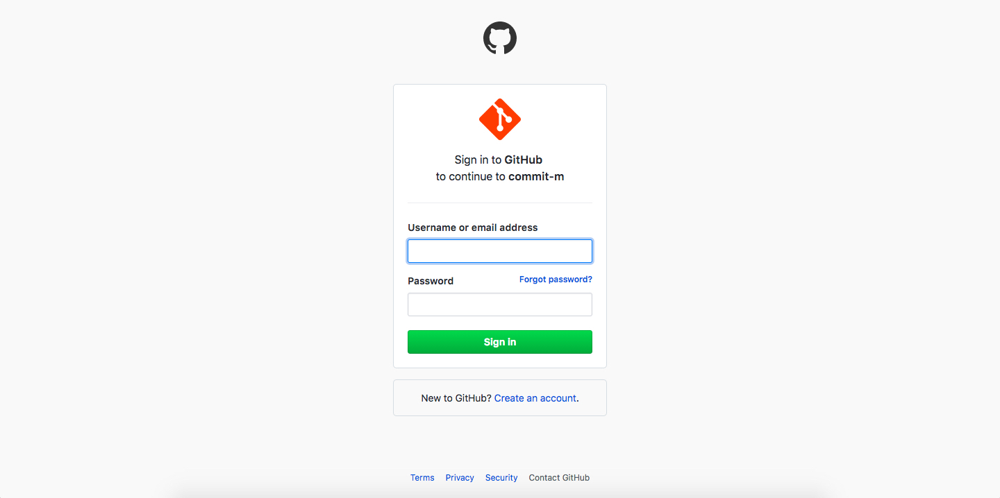
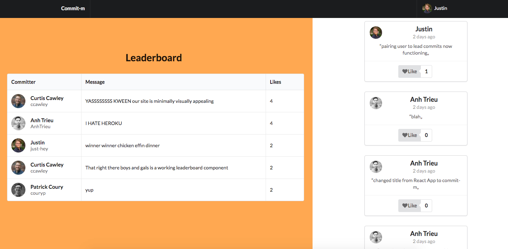

# Commit-m

*Authors: [Anh Trieu](https://github.com/AnhTrieu "Anh Trieu's GitHub"), [Curtis Cawley](https://github.com/ccawley "Curtis Cawley's GitHub"), and [Justin Hays](https://github.com/just-hey "Justin Hays' GitHub")*

Commit-m is a full stack React App that encourages commit message creativity, allows users to view what others are committing about, and "like" messages they enjoy.  Once authenticated, users can view and like all other Commit-m messages.

Commit-m was created in 1.5 weeks.

### Deployed here: http://commit-m.surge.sh/
#### Frontend GitHub: https://github.com/AnhTrieu/Commit-mENT-frontend-
#### Backend GitHub: https://github.com/AnhTrieu/Commit-mENT-backend-

## Features
- Managed state through React components
- Dynamic leaderboard based off likes/upvotes from users
- Send and retrieve authenticated data from server using REST API
- Register and Login via OAuth linked to GitHub

## Technologies
#### Frontend
- React.js
- Semantic-UI-React
- JSX
- JavaScript
- AJAX/axios

#### Backend
- PostgreSQL
- Authentication via OAuth
- Knex.js
- Node.js
- Express.js
- REST API
- JavaScript

## Screenshots

### Splash Page:

### Register GitHub via OAuth:

### Main Page with leaderboard:

